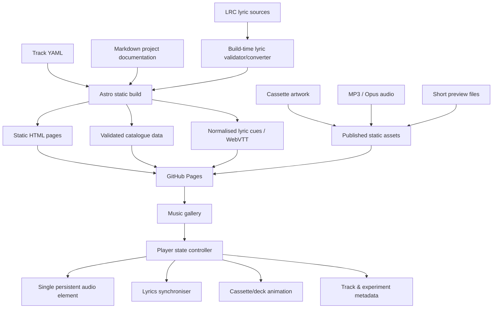
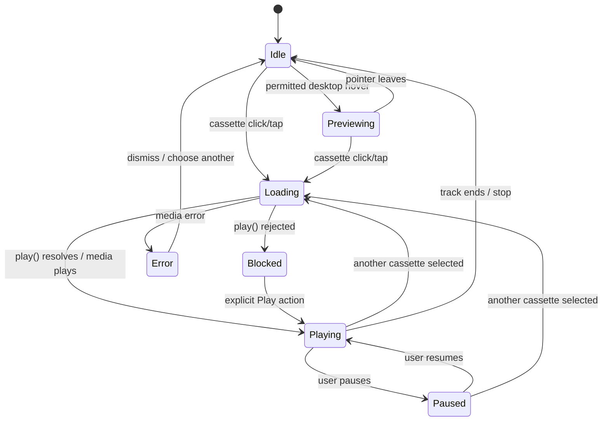

# GitHub Pages Music Showcase: Architecture and Implementation Report

## Executive summary

A cassette-style interactive music gallery is a very practical fit for GitHub Pages. The difficult parts are not the cassette animation itself; they are **audio policy, loading discipline, mobile interaction, synchronised lyrics, accessibility, and keeping the catalogue maintainable as the project history grows**.

GitHub Pages is a static hosting service for HTML, CSS and JavaScript, with optional build tooling. A published Pages site may be up to 1 GB, has a soft bandwidth limit of 100 GB per month and a ten-minute deployment timeout. GitHub recommends keeping repositories relatively small, and individual ordinary Git objects are effectively capped at 100 MB. citeturn15search11turn14search0turn14search12turn14search28

The architecture I recommend is:

> **Astro static site + Markdown documentation + YAML track catalogue + LRC source lyrics + build-time lyric validation/conversion + one persistent HTML audio player + vanilla TypeScript/JavaScript for the interactive gallery.**

Astro is a particularly strong fit because its default output is static, it officially supports deployment to GitHub Pages through GitHub Actions, and its content collections can consume Markdown, YAML, JSON and related content formats. citeturn15search25turn15search7turn15search1

The critical design decision is that the **music gallery should be the showcase, while the rest of the site remains conventional, durable documentation**. The cassette player can be theatrical; the installation guide should not be.

The proposed information architecture is:

| Area | Purpose |
|---|---|
| **Music** | Curated cassette gallery, full tracks, timed lyrics and generation metadata |
| **Working Solution** | The concise “this is what works now” guide |
| **Journey** | Chronological narrative from early ACE-Step through the music-library/Spotify-like application and into MiniMax |
| **ACE-Step** | Installation, experiments, reference audio, batch generation, judging, Autopilot and failures |
| **MiniMax** | Current workflows, YAML song definitions, parameter sweeps, precomputation and results |
| **Experiments** | Reproducible comparisons, CFG/step/seed tests, conclusions |
| **Tools** | Generator, review application, ledger, judging and supporting utilities |
| **Failures** | Negative results, bugs and abandoned approaches that are worth documenting |

The music page should work approximately as follows:

1. The visitor sees a grid or shelf of cassette artwork.
2. On a desktop device capable of real hover, a cassette raises/highlights when hovered.
3. **Sound-on-hover must be treated as an enhancement rather than something guaranteed on first visit.** Chrome recommends waiting for user interaction before beginning audible playback, while WebKit explicitly advises sites to assume audio may require a user gesture and to handle a rejected `play()` promise. citeturn14search1turn14search6turn18search30
4. After an initial deliberate audio interaction, desktop hover previews can be enabled.
5. Clicking or tapping a cassette loads the full track into one persistent audio element and starts playback directly from the click handler.
6. The cassette simultaneously animates into the deck.
7. Lyrics appear beside it and follow `currentTime`.
8. Selecting another cassette changes the source rather than creating another full audio player.
9. On mobile, there is no reliance on hover: tapping a cassette plays/selects it, and the layout collapses to one column.
10. Reduced-motion users get a simple state change rather than the physical cassette-travel animation. The `prefers-reduced-motion` media feature exists specifically for this purpose. citeturn18search0

One particularly important implementation rule is:

> **Do not make the animation responsible for starting the music.**

The click should call `play()` immediately; the animation runs in parallel. Delaying `play()` until an animation callback, timer or asynchronous operation finishes risks losing the user-activation context on stricter browsers. WebKit specifically recommends assuming audible media needs an explicit gesture, and `play()` exposes a Promise so denial can be handled rather than guessed at. citeturn14search6turn18search30

Likewise:

> **The real `<audio>` element is the source of truth. The cassette animation reflects its state, not vice versa.**

If audio stalls, the deck displays buffering. If `play()` is rejected, the deck displays a Play control rather than pretending the tape is spinning. If playback pauses, the reels stop.

The site can initially host a curated collection of compressed web audio directly through Pages, but the catalogue should contain abstract audio URLs so that the tracks can later move to object storage or a CDN without redesigning the application. GitHub's 1 GB site limit is not problematic for a small showcase; the 100 GB/month soft bandwidth limit is more likely to matter if the gallery becomes popular. citeturn14search0

For lyrics, I recommend **authoring in LRC but compiling to normalised cue data and optionally WebVTT at build time**. LRC is pleasant for music editing and has libraries supporting ordinary and enhanced timestamps; WebVTT is the standards-based browser timed-text format and integrates with HTML media text tracks and `cuechange`. citeturn19search0turn14search3turn18search2

For the first release, I would **not** build a service worker, waveform visualiser, real-time spectrum analyser, GSAP choreography or word-by-word karaoke. The architecture should permit those features later, but they are not necessary to prove the core experience.

The first implementation milestone should instead be **one cassette, one finished song, responsive player, correctly synchronised lyrics and a documentation page**. Once that vertical slice is excellent, adding forty songs becomes data entry rather than further application development.

## Recommended architecture and GitHub Pages constraints

GitHub Pages can serve static HTML, CSS, JavaScript and other files directly from a repository. It does not provide your site with a runtime application server, database, secret-bearing API proxy or arbitrary server-side code. A build process can run before deployment, but once published the browser is receiving static assets. citeturn15search11turn15search5

That is not a disadvantage here. Nearly everything the proposed site needs can be calculated in advance:

- track metadata;
- documentation HTML;
- lyric cues;
- cassette thumbnails;
- preview excerpts;
- waveform data, should it later be added;
- experiment indexes and cross-links.

The dynamic part is entirely browser-side: playback, seeking, animation, filtering and lyric highlighting.

**Recommended stack**

| Approach | Strengths | Weaknesses | Verdict |
|---|---|---|---|
| Plain HTML/CSS/JS | Almost no tooling; extremely durable; simple deployment | Documentation and catalogue duplication becomes tedious; little schema validation | Good for a tiny prototype |
| Jekyll | Native historical GitHub Pages integration; Markdown friendly | Ruby/Jekyll conventions add little value to the music UI | Viable, not my preference |
| Eleventy | Excellent lightweight static generator; documentation friendly | More manual application structure than Astro | Strong alternative |
| **Astro + vanilla JS/TS** | Static by default; content collections; YAML/Markdown; components without requiring a client framework; official Pages deployment guide | Adds a Node build step | **Recommended** |
| React/Vue SPA | Rich component model | Unnecessary client runtime and routing complexity for predominantly static documentation | Avoid unless the project changes substantially |

GitHub itself allows any static generator provided the finished files are deployed appropriately, and recommends GitHub Actions when using a generator other than its normal Jekyll route. Astro's official GitHub guide specifically documents static, prerendered Pages deployment through Actions. citeturn15search5turn15search7

A suitable repository structure would be:

```text
/
├── astro.config.mjs
├── package.json
├── src/
│   ├── components/
│   │   ├── CassetteCard.astro
│   │   ├── CassetteDeck.astro
│   │   ├── LyricsPanel.astro
│   │   ├── TrackMetadata.astro
│   │   └── SiteNavigation.astro
│   │
│   ├── content/
│   │   ├── tracks/
│   │   │   ├── gimmie-gimmie-ball.yaml
│   │   │   ├── golden-rhapsody.yaml
│   │   │   └── ...
│   │   └── docs/
│   │       ├── working-solution/
│   │       ├── journey/
│   │       ├── acestep/
│   │       ├── minimax/
│   │       ├── experiments/
│   │       ├── tools/
│   │       └── failures/
│   │
│   ├── pages/
│   │   ├── index.astro
│   │   ├── music/
│   │   ├── working-solution/
│   │   ├── journey/
│   │   ├── acestep/
│   │   ├── minimax/
│   │   └── experiments/
│   │
│   ├── scripts/
│   │   ├── player.ts
│   │   ├── lyrics.ts
│   │   ├── preview.ts
│   │   └── animation.ts
│   │
│   └── styles/
│
├── content-source/
│   └── lyrics/
│       └── *.lrc
│
├── public/
│   ├── audio/
│   │   ├── previews/
│   │   └── tracks/
│   ├── images/
│   │   └── cassettes/
│   └── lyrics/
│       └── generated/
│
└── .github/
    └── workflows/
        └── pages.yml
```

Astro content collections can load local YAML, JSON, Markdown and other formats and can enforce a defined data shape, which is useful here because a malformed track definition should fail the build rather than result in a mysteriously broken cassette after deployment. citeturn15search1turn15search19

The component relationship should remain deliberately simple:



The distinction between a **user/organisation Pages site** and a **project Pages site** matters. Project sites can live beneath a repository path rather than the origin root, so hard-coded assumptions such as `/audio/song.mp3` can become troublesome unless the base path is correctly configured. Astro's Pages documentation accounts for deployment configuration, and using a custom domain also removes the repository-subpath issue from public URLs. citeturn15search7turn15search23

I would therefore avoid scattering literal URLs throughout track YAML. Treat assets as build-managed resources or apply the configured base URL centrally.

GitHub's current limits also influence the design. The published site is capped at 1 GB; its monthly bandwidth has a soft 100 GB limit; the ordinary Git object limit is enforced at 100 MB; and Git recommends keeping repositories small. Git LFS has separate storage and bandwidth metering, so it should not be treated as a magic solution to a large public streaming catalogue. citeturn14search0turn14search28turn14search16

For this reason:

**Keep master WAV/FLAC generations out of the Pages repository.** Publish web derivatives only.

The catalogue schema should also make relocation trivial:

```yaml
id: gimmie-gimmie-ball
title: "Gimmie Gimmie Ball"
slug: "gimmie-gimmie-ball"

featured: true
date: "2026-08-01"

model:
  family: "MiniMax"
  name: "Music 3"

generation:
  songVersion: 2
  cfg: 1.70
  steps: 31
  seed: 7

audio:
  sources:
    - format: "opus"
      src: "audio/tracks/gimmie-gimmie-ball.opus"
    - format: "mp3"
      src: "audio/tracks/gimmie-gimmie-ball.mp3"
  preview:
    src: "audio/previews/gimmie-gimmie-ball.mp3"
    start: 0
    duration: 12

artwork:
  src: "images/cassettes/gimmie-gimmie-ball.webp"
  alt: "Cassette artwork for Gimmie Gimmie Ball"

lyrics:
  source: "gimmie-gimmie-ball.lrc"

documentation:
  experiment: "experiments/gimmie-gimmie-ball-v2"
  modelNotes: "minimax/music-3"

tags:
  - "MiniMax"
  - "western-swing"
  - "featured"
```

The actual public audio root can then later become an external media hostname at build time without rewriting every component.

Documentation should similarly be data-connected. A generation's page should be able to refer back to the music catalogue rather than manually duplicating model, version and configuration information.

That creates a useful rule for the whole site:

> **Write a fact once; display it wherever it is relevant.**

The song YAML owns generation metadata. The experiment Markdown owns interpretation. The LRC owns lyric timing. The audio file owns audio. The components only present them.

## Gallery UI, responsive behaviour and accessibility

The cassette concept should provide identity without forcing every aspect of the site into theatrical skeuomorphism.

The ideal hierarchy is:

```text
PROJECT TITLE / NAVIGATION

Introductory statement
"Months of testing ACE-Step and MiniMax..."

────────────────────────────────

MUSIC SHOWCASE

[cassette] [cassette] [cassette] [cassette]
[cassette] [cassette] [cassette] [cassette]

────────────────────────────────

SELECTED TRACK

┌────────────────────────────┬──────────────────────────────┐
│                            │                              │
│       CASSETTE DECK        │      SYNCHRONISED LYRICS     │
│                            │                              │
│       [ cassette ]         │      previous line           │
│        ○        ○          │                              │
│                            │      CURRENT LYRIC            │
│   play  ━━━━━●━━━━  3:44   │                              │
│                            │      next line               │
│  MiniMax Music 3           │                              │
│  CFG 1.70 · Steps 31       │      generation details      │
└────────────────────────────┴──────────────────────────────┘

VIEW THE EXPERIMENT →

────────────────────────────────

PROJECT DOCUMENTATION / JOURNEY
```

I would **not** keep the player permanently occupying half the first viewport before anything has been chosen. Initially the cassettes are the hero. Selecting a cassette activates/reveals the deck beneath them. That gives the music collection visual priority and avoids presenting a large inactive control panel to a first-time visitor.

For wide displays, the selected-track area should use two columns: roughly 55–60% deck and controls, 40–45% lyrics and metadata. CSS Grid with flexible minimums is preferable to hard-coded widths.

Conceptually:

```css
.now-playing {
    display: grid;
    grid-template-columns:
        minmax(0, 1.15fr)
        minmax(20rem, 0.85fr);
    gap: clamp(1rem, 3vw, 3rem);
}
```

At a sensible breakpoint determined by the content rather than by a named device, it becomes one column.

On a narrow phone:

```text
┌───────────────────────┐
│       CASSETTE        │
│        DECK           │
│                       │
│   [ selected tape ]   │
│                       │
│  ◀  ▶  ━━━━━●━━━      │
├───────────────────────┤
│    CURRENT LYRIC      │
│    next lyric         │
├───────────────────────┤
│ Track details         │
└───────────────────────┘

[cassette]
[cassette]
[cassette]

┌───────────────────────┐
│ Gimmie...   ▶   2:14  │  ← optional sticky mini-player
└───────────────────────┘
```

WCAG 2.2 requires content to reflow at narrow equivalent widths rather than demanding two-dimensional scrolling for ordinary content, and requires keyboard-operable functionality, visible focus and sufficient target sizing. The Level AA minimum target criterion is 24 CSS pixels subject to exceptions; for a music player on touch screens, I would voluntarily design primary controls closer to 44×44 CSS px or larger. citeturn15search0turn15search6

**Cassette cards should not depend on hover.** Hover is decoration plus an optional desktop preview. All essential information remains visible or obtainable by keyboard/touch.

A cassette should expose:

- title;
- visual artwork;
- model badge;
- visible selected state;
- keyboard focus state;
- explicit route to technical details.

The selected state and keyboard focus state must not be identical. For example:

```text
Hover     = rises slightly + temporary illumination
Focus     = clear outline/ring
Selected  = persistent deck-coloured border/glow + "Now playing"
Playing   = small play indicator/reel movement
```

This prevents the common mistake where a glow means three unrelated things.

For artwork, use an explicit `aspect-ratio` to create a consistent rectangular cassette shape while permitting each song its own art direction. Images should carry explicit dimensions to prevent layout shift; MDN specifically recommends width and height for images and notes their importance with lazy loading. citeturn16search1

I would use something approximately between 3:2 and 16:10 rather than literal cassette dimensions. The goal is visual language, not a scale museum replica.

**Desktop hover behaviour** should only be activated when the input device reports both meaningful hover and a fine pointer:

```css
@media (hover: hover) and (pointer: fine) {
    .cassette:hover {
        transform: translateY(-0.35rem) rotate(-0.3deg);
    }
}
```

The JavaScript preview controller should use the same capability test before attaching audio-preview behaviour.

**Touch behaviour** should be intentionally different:

- one tap on a cassette selects/plays the full track;
- tapping the currently playing cassette can take the user to its deck/details or pause according to the final interaction design;
- there is no long-press dependency;
- there is no “tap once to simulate hover, tap again to activate” pattern;
- an explicit Preview control can be added if separate previews prove useful on mobile.

Trying to reproduce desktop hover on a phone is unnecessary complexity.

Accessibility should influence the sound behaviour more strongly than it normally does on flashy portfolio sites. WCAG's audio-control guidance specifically recommends playing sounds only on user request and requires a mechanism to stop automatically playing sound lasting longer than three seconds. citeturn15search0

Consequently, I recommend this compromise for the requested hover previews:

**Fresh visit**

```text
Hover cassette → visual preview only
Click/tap cassette → audio starts
```

**After first deliberate audio interaction**

```text
Desktop hover → optional short preview
Click cassette → full playback
```

A setting can make this explicit:

```text
Hover previews: [ On / Off ]
```

Store that preference locally if desired. Defaulting it off is the safest accessibility choice; defaulting it on *after* audio has been deliberately enabled better preserves the desired experience.

Do **not** automatically play previews when a keyboard user merely tabs onto every cassette. Focus navigation is not a sensible equivalent of mouse auditioning. Instead, keyboard users receive a real Preview or Play control. Informational content that appears on hover should still be available on focus because WCAG addresses content revealed by hover or focus. citeturn15search6

The custom player itself should use semantic controls:

```html
<button type="button" aria-label="Play Gimmie Gimmie Ball">
    Play
</button>
```

rather than clickable `<div>` elements.

The underlying `<audio>` should retain browser controls as a fallback until the custom player successfully initialises. Native audio controls provide playback, volume, seeking and pause/resume functionality. citeturn17search0

A useful progressive-enhancement pattern is:

```html
<audio controls preload="none" id="showcase-player">
    <p>
        Your browser cannot use the interactive player.
        A direct audio download/listen link is available here.
    </p>
</audio>
```

Once JavaScript verifies that the custom controls are operational, it can remove the native `controls` presentation while continuing to operate the same media element.

Likewise, every featured song should have a real static track page such as:

```text
/music/gimmie-gimmie-ball/
```

containing title, art, native audio fallback, full lyrics, model information and experiment links. The enhanced gallery is then not the sole way to access the content.

For lyrics, avoid `aria-live` announcing every new line. That would cause a screen reader to continually interrupt the user. Present the complete lyric as normal document content and visually mark the active line. The static transcript also makes the track meaningful to somebody who cannot or chooses not to hear it.

Motion must be optional. `prefers-reduced-motion` communicates a user's request for less non-essential movement. citeturn18search0 The reduced-motion version of:

```text
cassette lifts
→ travels 500 px across screen
→ rotates
→ drops into slot
→ deck closes
```

should simply become:

```text
old cassette fades
→ new cassette appears selected in deck
```

The information and state change remain; the simulated physical journey does not.

## Audio, timed lyrics and animation implementation

The audio layer should be much simpler than the visual presentation implies.

There should be **one persistent main audio element**.

```text
Gallery cassette 1 ─┐
Gallery cassette 2 ─┤
Gallery cassette 3 ─┼──▶ Player controller ───▶ <audio>
Gallery cassette n ─┘
```

Selecting another song changes its source and metadata. This avoids multiple full-track audio elements competing for playback and creates one obvious source of playback truth.

A separate preview element may be used for short desktop excerpts, but it should be strictly subordinate to the full player. While a complete song is playing, I recommend suppressing hover previews entirely; accidental mouse movement should never interrupt music the visitor has deliberately chosen.

The state machine should be explicit:



The `play()` method returns a Promise, and both browser guidance and the API design mean the interface should respond to success or failure rather than assuming a call means audible playback began. citeturn14search6turn18search30

A simplified selection function therefore looks conceptually like:

```js
async function selectTrack(track) {
    setPlayerState("loading");

    player.src = choosePlayableSource(track);
    player.load();

    // Start the visual choreography immediately.
    animateCassetteInsertion(track.id);

    try {
        // Called directly as part of the user's activation path.
        await player.play();
        setPlayerState("playing");
    } catch (error) {
        setPlayerState("blocked");
        showExplicitPlayButton();
    }
}
```

The real code should listen to media events such as `playing`, `waiting`, `pause`, `ended`, `error`, `seeking` and `seeked` as well. The `<audio>` element exposes these media events directly. citeturn17search0

Do not write:

```js
animateCassette().then(() => {
    audio.play();
});
```

as the only path. The user gesture may no longer be usable by the time that asynchronous sequence completes on restrictive platforms. Audible autoplay policies differ, so explicit interaction followed by error handling is the robust approach. citeturn14search1turn14search6

**Audio format choice**

| Format | Use in this project | Advantages | Drawbacks |
|---|---|---|---|
| **MP3** | Recommended universal/simple web derivative | Extremely mature ecosystem and practical browser compatibility; straightforward files | Less efficient than newer codecs at equivalent subjective quality |
| **Opus** | Recommended optional preferred source | Designed as a general-purpose efficient codec and well suited to music | Adds a second derivative and codec/container decision |
| AAC/M4A | Reasonable alternative | Efficient and common | Little reason to introduce it if MP3 + Opus already covers the requirement |
| FLAC | Optional downloadable archival derivative | Lossless | Far too large as the default streaming source |
| WAV | Masters only | Simple uncompressed master interchange | Very large; poor web-delivery choice |

MDN describes Opus as a good general-purpose web audio codec and provides browser/media capability guidance; browsers can also be queried with `canPlayType()` rather than relying on assumptions. citeturn16search0turn18search3

My launch recommendation is:

```html
<audio preload="none">
    <source src="song.opus" type="audio/ogg; codecs=opus">
    <source src="song.mp3" type="audio/mpeg">
</audio>
```

provided actual target-device testing confirms the chosen Opus container is satisfactory. A **single MP3 derivative** is also entirely reasonable for version one if simplicity matters more than squeezing bandwidth.

For music where generation artefacts are part of the subject being demonstrated, do not compress too aggressively. A practical starting experiment is **160–192 kbps for the showcase listening copy**, compared blind against the master. That is an engineering recommendation rather than a GitHub requirement.

The arithmetic illustrates why this matters:

| Bitrate | Approx. MB per minute | Approx. four-minute song |
|---:|---:|---:|
| 128 kbps | 0.96 MB | 3.84 MB |
| 160 kbps | 1.20 MB | 4.80 MB |
| 192 kbps | 1.44 MB | 5.76 MB |
| 256 kbps | 1.92 MB | 7.68 MB |
| 320 kbps | 2.40 MB | 9.60 MB |

Thus 20 four-minute tracks at 192 kbps are roughly **115 MB** before images, previews and code. That is comfortable relative to GitHub Pages' 1 GB published-site ceiling, although traffic rather than raw site size may eventually become the limiting concern. citeturn14search0

A 15-second 128 kbps preview is only about 0.24 MB. Separate preview files therefore make considerably more sense than starting a multi-megabyte full-song request merely because the pointer briefly crossed a cassette.

The `<audio preload>` attribute supports `none`, `metadata` and `auto`, but it is only a hint; browsers retain discretion over what they actually fetch. `auto` may cause the whole audio resource to be downloaded. citeturn17search0

I would use:

```text
Full catalogue tracks       preload none
Selected track              load on selection
Current track metadata      naturally fetched during selection
Short hover preview         fetch on actual preview intent
Next track                  no automatic preload initially
```

For previews, add a small hover-intent delay—perhaps roughly 150–250 ms—before requesting audio. This prevents a sweep of the pointer across six cassette cards causing six unnecessary media requests.

**Timed lyric choices**

| Format / approach | Strength | Weakness | Recommendation |
|---|---|---|---|
| **LRC** | Compact, easy to edit manually, designed around music timestamps | Not the native HTML timed-text standard | **Best authoring format** |
| **Enhanced LRC** | Can support finer-grained/word-level timing | More labour and parser dependence | Later karaoke enhancement |
| **WebVTT** | W3C timed-cue format; integrates with `<track>` and TextTrack APIs | More verbose for hand-editing songs | **Best standards/output format** |
| JSON cue array | Ideal application runtime structure | Poor authoring format and no interoperability standard | **Best generated runtime representation** |
| SRT | Familiar subtitle format | Less natural integration for this player than WebVTT | No real advantage here |

WebVTT is a W3C format consisting of timed cues and can be used for time-aligned metadata as well as traditional captions. The HTML text-track APIs expose cue changes to JavaScript. citeturn14search3turn18search6turn18search14

LRC remains attractive because an author can comfortably maintain:

```text
[00:12.40]I know that look, I know that sound
[00:16.82]There's probably a tennis ball around
[00:21.18]...
```

instead of:

```text
WEBVTT

00:00:12.400 --> 00:00:16.820
I know that look, I know that sound

00:00:16.820 --> 00:00:21.180
There's probably a tennis ball around
```

Libraries such as Liricle support basic and enhanced LRC and provide synchronization functionality; `lrc-file-parser` is another small JavaScript parser. citeturn19search0turn19search1

I would nevertheless **parse the LRC during the build rather than ship a parser solely to every visitor**.

The build step can:

```text
lyrics/song.lrc
        │
        ▼
parse
        │
        ├── validate monotonically sensible timestamps
        ├── reject malformed lines
        ├── attach line IDs
        ├── calculate implicit end times
        │
        ├──▶ song.lyrics.json
        └──▶ song.vtt
```

That yields both an ergonomic source format and standards-friendly output.

A generated cue representation might look like:

```json
[
  {
    "start": 12.4,
    "end": 16.82,
    "text": "I know that look, I know that sound"
  },
  {
    "start": 16.82,
    "end": 21.18,
    "text": "There's probably a tennis ball around"
  }
]
```

For **line-level synchronisation**, listen to `timeupdate` and find the active cue from `audio.currentTime`. The event frequency varies with browser/system load and is not a fixed animation clock, but it is entirely suitable for ordinary lyric lines. citeturn17search1

Do not scan 300 lyric entries from the beginning at every update. Since the cues are time ordered, use:

- the previous active index for normal forward playback;
- binary search after a seek or large time jump.

Handle at least:

```text
timeupdate
seeking
seeked
loadedmetadata
ratechange
ended
```

If the project later gains **word-by-word karaoke highlighting**, use `requestAnimationFrame()` while playback is active rather than expecting `timeupdate` to update at display-frame frequency. `requestAnimationFrame()` schedules work before browser repaint and is the appropriate mechanism for frame-synchronised visual updates. citeturn17search1turn18search1

If WebVTT is used directly, `cuechange` provides another clean mechanism for responding when the active timed cue changes. citeturn18search2

The lyric panel should contain perhaps:

```text
previous line

CURRENT LINE

next line

next line
```

while keeping the whole transcript in the DOM. Auto-scrolling should centre the current lyric **until the visitor manually scrolls the lyric panel**. Once they take manual control, suspend automatic scrolling and reveal a small:

```text
Return to current lyric
```

control. Otherwise the interface will repeatedly fight somebody who is trying to read ahead.

**Animation choice**

| Technique | Best use | Advantages | Costs | Recommendation |
|---|---|---|---|---|
| CSS transitions | Hover lift, glow, button state | Tiny, declarative | Poor for long choreography | **Use heavily** |
| CSS keyframes | Reel rotation, LED pulse | Tiny and performant | Awkward orchestration | **Use heavily** |
| Web Animations API / JS | Cassette position sequence and state transitions | Native and controllable | Slightly more code | **Use for insertion/ejection** |
| `requestAnimationFrame()` | Custom continuously calculated effects | Precise frame updates | Easy to overbuild | Use only when required |
| GSAP | Elaborate multi-stage choreography | Excellent timeline abstraction | Dependency and extra conceptual layer | Consider later |
| Motion | Compact animation abstraction | Small variants are available; easy sequencing | Another dependency | Not necessary initially |

MDN recommends browser-aligned animation approaches such as `requestAnimationFrame()` rather than timer-driven frame loops; transforms and opacity are generally the right properties to favour for smooth visual animation. citeturn18search5turn18search9 GSAP's timeline facilities are specifically designed for coordinated animation sequences, while Motion offers a compact JavaScript animation implementation, but neither library is necessary to make the cassette work. citeturn19search2turn19search7

A CSS/JS split such as this is enough:

```text
CSS:
    hover lift
    focus ring
    selected glow
    reel spin
    LED blink
    opacity changes
    loading shimmer

JavaScript / WAAPI:
    gallery position → deck position
    eject old cassette
    insert new cassette
    cancel/reverse interrupted sequences
```

The cassette insertion should probably last in the region of **500–800 ms**, while audio begins loading/playback immediately. It should feel physical without making somebody wait for an animation every time they choose a song.

The real audio events then control cosmetics:

```js
audio.addEventListener("playing", () => {
    deck.dataset.state = "playing";
});

audio.addEventListener("pause", () => {
    deck.dataset.state = "paused";
});

audio.addEventListener("waiting", () => {
    deck.dataset.state = "buffering";
});

audio.addEventListener("ended", () => {
    deck.dataset.state = "ended";
});
```

This produces an important separation:

```text
Audio engine  = truth
Player state  = interpretation
Animation     = presentation
```

rather than:

```text
Animation says "playing"
therefore presumably audio is playing
```

## Catalogue, assets and documentation model

The catalogue should be **content data, not JavaScript source code**.

That difference becomes increasingly important once the site documents months of ACE-Step and MiniMax work.

Avoid:

```js
const tracks = [
    // 600 lines of hand-written JS objects
];
```

Prefer a validated track collection where each song is an independent YAML file. Astro supports build-time content collections from YAML, Markdown and related formats, making this a natural use case. citeturn15search1turn15search19

The schema should distinguish **a composition**, **a chosen published generation**, and **an experiment**.

For example:

```text
Golden Rhapsody
│
├── song definition v1
├── song definition v2
│   │
│   ├── generation 001
│   ├── generation 002
│   ├── generation 003
│   └── generation 004 ← showcase version
│
├── CFG sweep
├── step sweep
└── showcase track
```

That distinction matters because the public cassette is a *selected result*, not the entire research object.

A richer schema could therefore contain:

```yaml
id: "golden-rhapsody-showcase"
composition: "golden-rhapsody"

title: "Golden Rhapsody"
subtitle: null

status: "featured"

model:
  provider: "MiniMax"
  model: "Music 3"

provenance:
  songVersion: 2
  generationNumber: 47

generation:
  cfg: 1.70
  steps: 31
  seed: 7

style:
  summary: "Late-1940s western swing / novelty country"
  tags:
    - western-swing
    - novelty-country

audio:
  duration: 224.6
  previewStart: 62.0
  previewDuration: 12.0
  sources:
    mp3: "..."
    opus: "..."

lyrics:
  file: "golden-rhapsody.lrc"
  synchronisation: "line"

artwork:
  cassette: "golden-rhapsody.webp"
  alt: "..."

links:
  experiment: "/experiments/golden-rhapsody/"
  songDefinition: "/minimax/song-definitions/golden-rhapsody/"
  model: "/minimax/music-3/"

notes:
  short: "Selected from the controlled CFG/step comparison."

aiGenerated: true
```

A build schema should enforce things such as:

```text
ID unique?
Title present?
Referenced artwork exists?
At least one playable audio derivative?
Preview start inside track duration?
Lyric file exists?
Experiment route valid?
Generation numbers numeric?
AI disclosure field present?
```

Then a bad catalogue commit fails CI visibly.

The documentation should use Markdown because the technical history is text-heavy and will continually evolve. Astro explicitly supports Markdown content and YAML/TOML frontmatter. citeturn15search4

The strongest documentation structure for this project is not purely chronological and not purely encyclopaedic. It needs both.

```text
HOME
│
├── MUSIC
│   ├── Track pages
│   └── Gallery
│
├── WORKING SOLUTION
│   ├── ACE-Step, where still relevant
│   ├── MiniMax
│   ├── Current hardware
│   └── Current recommended workflow
│
├── JOURNEY
│   ├── Early ACE-Step
│   ├── Automated judging
│   ├── Batch generation
│   ├── Reference/remix experiments
│   ├── Autopilot
│   ├── Generation ledger
│   ├── Spotify-like review application
│   ├── Spectrogram/review tooling
│   ├── Move to MiniMax
│   └── Current experiments
│
├── ACE-STEP
│   ├── Setup
│   ├── Models
│   ├── Prompts
│   ├── Reference audio
│   └── Results
│
├── MINIMAX
│   ├── Setup
│   ├── Song YAML
│   ├── CFG
│   ├── Steps
│   ├── Seeds
│   ├── Precomputation
│   └── Results
│
├── EXPERIMENTS
│   ├── Parameter sweeps
│   ├── Reference tests
│   └── Quality comparisons
│
├── TOOLS
│   ├── Generator
│   ├── Judge
│   ├── Review UI
│   └── Ledger
│
└── FAILURES
    ├── Robotic batches
    ├── Broken Autopilot runs
    ├── CUDA failures
    └── Things that simply made the music worse
```

The `Working Solution` should be aggressively concise compared with the historical sections. It answers:

> “I have read none of the story. What would you install and run today?”

The `Journey` answers:

> “Why did the working solution end up like this?”

The model sections answer:

> “What exactly did you discover about ACE-Step or MiniMax?”

The experiment pages answer:

> “Where is the evidence?”

The track page answers:

> “How did *this particular song* happen?”

These distinctions prevent a 40,000-word technical diary from swallowing the useful instructions.

Artwork should be exported in modern web sizes rather than storing enormous source PSD/PNG assets in the deployment. Lazy-loaded `` elements save network/storage work until the artwork approaches the viewport, and explicit dimensions prevent layout movement. citeturn16search1

A reasonable cassette-art pipeline is:

```text
master artwork
      │
      ├── 640-ish px gallery derivative
      └── 1280-ish px high-density/detail derivative
```

with WebP/AVIF considered where appropriate and a conventional fallback if testing reveals need. The exact dimensions should come from the final layout rather than being chosen before the cassette component exists.

Do not put text essential to understanding a track solely inside its artwork. The cassette can have beautifully rendered fake labels, catalogue numbers and handwritten titles, but the real title/model remain HTML text.

## Performance, caching, offline behaviour and security

The most important performance decision is simple:

> **Do not load the music collection when the visitor loads the homepage.**

An interactive music showcase can look lightweight while silently transferring hundreds of megabytes. The default network behaviour must be the opposite.

A good initial-load strategy is:

```text
Initial HTML
    ↓
critical CSS
    ↓
small gallery/player JS
    ↓
first visible cassette artwork
    ↓
remaining artwork lazy-loaded
    ↓
NO full audio yet
    ↓
NO preview audio yet
```

After interaction:

```text
hover intent after audio enabled
    ↓
one tiny preview requested

OR

cassette click
    ↓
one full song requested
    ↓
lyrics already tiny / loaded with metadata
```

The browser's `preload` value for audio is only a hint, but `none` explicitly signals that the author does not want speculative media loading. `metadata` can retrieve duration and related information without expressing a desire for the entire song; `auto` may retrieve the whole file. citeturn17search0

Catalogue duration should therefore ideally be generated at build time and included in YAML/JSON, so the browser does not need to touch every MP3 merely to display `3:44`.

Likewise, a preview should be a **physically separate small file**, not merely:

```js
audio.currentTime = 63;
```

on the full 10 MB song. A browser may make range requests efficiently, but separate 200–300 KB previews make the intended network cost explicit.

For imagery, native lazy loading is appropriate below the first visible gallery area. MDN notes that `loading="lazy"` defers image loading until the resource approaches the viewport and recommends explicit width/height to avoid layout shift. citeturn16search1

I would establish a simple performance budget before implementation:

| Resource | Initial target |
|---|---:|
| HTML + critical CSS + player JS | Preferably comfortably under 250 KB compressed |
| Initial visible artwork | Roughly 100–300 KB total depending on count |
| Full audio transferred at initial page load | **0 bytes** |
| Preview audio before user intent | **0 bytes** |
| Third-party JavaScript | Ideally **0 bytes** |
| Web fonts | Zero or minimal |
| Initial service worker music precache | **0 bytes** |

Those are project targets, not GitHub limits.

The most effective performance optimisation will almost certainly be **not downloading things**, rather than micro-optimising JavaScript.

A service worker is technically practical on GitHub Pages because Pages can be served over HTTPS and service workers require secure contexts. Service workers can intercept requests and populate caches for offline behaviour. citeturn15search2turn17search2turn17search3

I would nevertheless leave it out of the first release.

Offline capability has three possible levels:

| Level | Behaviour | Recommendation |
|---|---|---|
| None | Network required | Acceptable for prototype |
| **Shell offline** | Previously visited documentation/UI works; music remains network-first | **Good later addition** |
| Explicit music download/cache | User deliberately chooses tracks to retain offline | Good PWA-stage feature |
| Entire catalogue precache | All music downloaded automatically | **Do not do this** |

The last option is hostile to storage, mobile data and deployment flexibility.

For a later service worker:

```text
Cache-first:
    hashed CSS
    hashed JS
    logos/icons
    small UI art

Stale-while-revalidate:
    documentation HTML where appropriate
    catalogue metadata

Network-first / normal browser cache:
    music

Explicit opt-in:
    tracks marked "available offline"
```

Audio seeking adds another layer because media clients can use partial/range requests. Do not invent an elaborate offline-audio caching implementation unless offline listening becomes a genuine requirement.

Progressive enhancement is more important than offline support.

With JavaScript unavailable:

```text
Home/documentation                works
Track catalogue                   works
Track detail pages                work
Native audio controls             work
Full lyrics                       work
Experiment links                  work
```

With JavaScript:

```text
cassette insertion                added
hover audition                    added
custom player                     added
synchronised lyric highlighting   added
dynamic filtering                 added
sticky mini-player                added
```

That is the correct dependency direction.

Browser compatibility should similarly split into **core** and **enhancement**.

Core functionality can rely on mature platform primitives such as HTML media, media playback promises, `timeupdate`, TextTrack/WebVTT, CSS Grid/Flexbox and `requestAnimationFrame`; several of these APIs are documented by MDN as broadly established across modern browsers. citeturn17search1turn18search1turn18search10turn18search30

I would explicitly test:

```text
Chrome desktop
Edge desktop
Firefox desktop
Safari desktop
Safari on iPhone
Safari on iPad
Chrome on Android
```

against the current releases at launch, with a policy of supporting roughly the current and previous major versions where practical rather than promising indefinite legacy-browser compatibility.

Feature detection should be preferred over browser sniffing:

```js
const canHover = matchMedia("(hover: hover) and (pointer: fine)").matches;

const supportsServiceWorker = "serviceWorker" in navigator;

const mp3Support = audio.canPlayType("audio/mpeg");
```

`canPlayType()` exists precisely to report the browser's likely ability to handle a particular MIME media type. citeturn18search3

Security is comparatively straightforward because there is no application backend, but static does not mean “nothing to worry about”.

The strongest policy is **no third-party runtime code unless it earns its place**.

If the site can use:

```text
Astro-built first-party JS
+
local CSS
+
local artwork
+
local music
```

then it has an unusually small supply-chain and privacy footprint.

Where external scripts are unavoidable, Subresource Integrity can ensure an expected cryptographic hash matches the downloaded script or stylesheet. citeturn16search2

A Content Security Policy can also restrict executable/resource origins and mitigate classes of injection attack. Some protections such as `frame-ancestors` specifically operate as response-header policy, so a static hosting arrangement with limited header control may require a proxy/CDN or different hosting architecture if such header-level controls become a hard requirement. citeturn16search4

For normal catalogue rendering:

```js
title.textContent = track.title;
```

is preferable to:

```js
title.innerHTML = track.title;
```

even though the data currently originates from your own repository. Maintaining that boundary prevents future content features from quietly turning catalogue metadata into executable markup.

Never put API keys, model service credentials or other secrets into browser JavaScript. GitHub warns that Pages sites are publicly available and explicitly advises removing sensitive information before publishing. citeturn15search2turn15search5

This has direct consequences for the project documentation. Redact:

- API keys;
- bearer tokens;
- private endpoints;
- credentials visible in terminal screenshots;
- personal filesystem information where unnecessary;
- private generation-service identifiers;
- URLs whose query strings contain secrets.

The fact that a repository itself might not be public does not make ordinary Pages content private; GitHub expressly warns that Pages sites are publicly accessible under normal configurations. citeturn15search2

For privacy, the showcase itself has no need to know who a listener is. I would launch with **no behavioural analytics, cookies or third-party music embeds**. Should analytics later be useful, choose deliberately what question it answers—page popularity, track plays, outbound GitHub clicks—and collect no more data than required.

A third-party comment system, contact form, analytics package or hosted player all materially change that privacy picture; none is necessary for the initial showcase.

## Legal, copyright and publishing considerations

The safest legal model is very simple:

> **Only publish audio, lyrics, artwork, samples and other assets that you created, generated under terms allowing the intended use, licensed appropriately, or otherwise have a defensible right to distribute.**

GitHub's Acceptable Use Policy prohibits content that infringes proprietary rights including copyright and trademark, and GitHub operates a DMCA notice-and-takedown process for alleged copyright infringement. citeturn20search4turn20search0

Music is especially important because a song is not necessarily one copyright object. UK Intellectual Property Office guidance explains that the sound recording, musical composition and lyrics can have separate copyright protection and ownership. citeturn20search1turn20search13

Consequently:

```text
"I own/generated this recording"
```

does **not automatically establish**

```text
"I have the right to publish every composition, lyric,
sample, reference excerpt and image contained in it."
```

For this particular showcase, maintain provenance alongside generation provenance.

A private rights ledger can record:

```yaml
track: "example-song"

composition:
  origin: "original"
  author: "Simon"
  clearance: true

lyrics:
  origin: "original"
  clearance: true

soundRecording:
  origin: "AI-assisted generation"
  model: "MiniMax Music 3"

referenceAudio:
  publishedOnSite: false
  notes: "Used in experiment only"

artwork:
  origin: "original / generated"
  clearance: true

thirdPartySamples: []

publicationApproved: true
```

It need not all be public, but it should exist.

For historical experiments using copyrighted reference material, the documentation can explain that a reference was tested without necessarily redistributing that reference file. Publishing the entire third-party reference audio merely to demonstrate a workflow is a very different act from mentioning the experiment.

Lyrics deserve the same care. UK guidance expressly recognises song lyrics as separately protected literary works. citeturn20search1 Do not reproduce commercial song lyrics simply because the site has a timed-lyrics engine.

For AI-generated music, terms of the actual generation service also matter independently from copyright law. MiniMax's published Music Creation Terms state that users are responsible for clearly labelling AI-generated output in their use. citeturn20search3

The site therefore should not hide its origin. It is a showcase *of* the AI-music work, so disclosure can be part of the visual language:

```text
AI-GENERATED / HUMAN-DIRECTED
MiniMax Music 3
Song definition v2 · Generation 47
```

or:

```text
Generated with ACE-Step
Selected and edited by Simon
```

That is both transparent and useful technical metadata.

Do not assume the legal status of an AI-generated work is identical in every jurisdiction. As one important example, the US Copyright Office's 2025 AI report concluded that generative outputs can receive copyright protection where sufficient human-authored expressive elements exist, while mere prompting alone does not establish the required authorship under its analysis. citeturn20search2turn20search6 UK rules and future case law should be considered separately rather than extrapolating that position universally.

Artwork can introduce copyright, trademark and publicity issues independently of music. GitHub's acceptable-use rules cover copyright, trademark and right-of-publicity infringements. citeturn20search4 A cassette cover that intentionally references a musical era is safer territory than duplicating another artist's protected cover art or making the site look officially endorsed by an unrelated artist/label.

For third-party software, retain licences for libraries, fonts and icon sets. This is another argument for using the web platform itself where practical instead of collecting a large dependency tree.

A sensible public footer can contain:

```text
About this project
AI generation disclosure
Source repository
Licences
Copyright / rights information
Contact
```

It does not need to turn into a legal portal.

The objective is simply to be able to answer, for anything publicly served:

> **What is this, where did it come from, and why am I entitled to publish it?**

That is particularly valuable for this project because provenance is already central to the technical work.

## Implementation priorities and pre-development decisions

The project should be built vertically rather than page-by-page.

Do not spend a week drawing twenty cassette covers before proving that one cassette works correctly on Safari on an iPhone.

The recommended sequence is:

```text
static site architecture
        ↓
one complete track
        ↓
accessible audio playback
        ↓
responsive player
        ↓
lyrics
        ↓
cassette animation
        ↓
data-driven catalogue
        ↓
multiple tracks
        ↓
documentation
        ↓
performance hardening
        ↓
optional flourishes
```

**Simple development checklist**

- [ ] Create Astro static project and GitHub Actions Pages deployment.
- [ ] Decide Pages project URL versus custom domain and configure the base path correctly.
- [ ] Define and validate the track YAML schema.
- [ ] Complete a rights/provenance audit for every public audio, lyric and artwork asset.
- [ ] Encode one representative song and one short preview derivative.
- [ ] Implement one persistent `<audio>` element with native fallback controls.
- [ ] Handle successful, blocked, buffering, paused, error and ended playback states.
- [ ] Implement responsive cassette grid and single-column mobile player.
- [ ] Add LRC validation and synchronised line-level lyrics.
- [ ] Add keyboard operation, visible focus, touch-sized controls and reduced-motion behaviour.
- [ ] Add cassette insertion/ejection only after playback logic is solid.
- [ ] Verify that the initial page downloads no full songs.
- [ ] Test Chrome, Edge, Firefox, macOS Safari, iPhone/iPad Safari and Android Chrome.
- [ ] Add the first real Working Solution and Journey documentation.
- [ ] Run a final public-repository check for credentials, sensitive information, rights issues and accidentally committed master audio.

The following are the **forty decisions I would answer before serious development**, ordered approximately from architecture-defining and potentially expensive-to-change decisions through to later polish.

1. **What is the site's primary first-visit objective: get somebody listening to a song, or get them reading about the research?** My recommendation is listening first, with the documentation one deliberate step behind it.

2. **Does clicking a cassette mean “play this now” without any intermediate confirmation?** I recommend yes; this creates a clean user gesture for browser audio policy and matches the physical metaphor.

3. **How should the site unlock hover-preview audio on a fresh browser session?** Decide between an explicit `Enable previews` action and implicitly enabling them after the first deliberate full-track play. The latter is less intrusive.

4. **When a full song is already playing, should hovering other cassettes preview them?** I strongly recommend no; deliberate playback should outrank accidental browsing.

5. **What exactly happens on mobile when a cassette is tapped?** Decide now whether it plays immediately, merely selects, or selects then requires Play. Immediate playback is the simplest consistent interpretation.

6. **Are desktop previews a core product feature or a progressive enhancement?** They should be an enhancement because audible hover cannot be made uniformly reliable before user activation. Chrome/WebKit policies make a universal first-hover guarantee unrealistic. citeturn14search1turn14search6

7. **Will launch audio be hosted inside GitHub Pages or at a separate media origin?** Same-origin Pages is simplest initially; preserve the ability to change only the audio base URL later.

8. **How large could the public catalogue plausibly become over the next few years?** Even without a current track constraint, distinguish “curated showcase” from “archive of every generation”; only the former belongs in the public music gallery.

9. **What web audio quality is good enough to demonstrate generation artefacts honestly?** Run blind comparisons of candidate encodes and choose the lowest bitrate that does not obscure differences you actually discuss.

10. **Will visitors be offered lossless/master downloads?** If yes, store those separately rather than making them the default Pages streaming asset.

11. **Have the rights to every public recording, lyric, artwork, sample and reference excerpt been established?** This is a release blocker, not a footer task. GitHub can process copyright takedown claims and prohibits infringement. citeturn20search0turn20search4

12. **What exact AI-origin disclosure appears on each track?** MiniMax's music terms currently place responsibility on users to clearly label AI-generated output, making this both useful provenance and a terms consideration. citeturn20search3

13. **Is each cassette a finished “promoted” generation rather than merely the newest generation?** The public catalogue should encode intentional curation so newer experiments cannot silently replace known-good tracks.

14. **What is the canonical identity of a track: composition, song-version or individual generation?** The data model should distinguish all three so the same composition can have ACE-Step, MiniMax and later variants.

15. **Does every featured cassette receive a permanent standalone URL?** I recommend yes: `/music/track-slug/`. This improves sharing, documentation cross-linking and no-JS fallback.

16. **What does the browser URL do while a cassette is selected in the gallery?** Decide whether selection updates a query/hash such as `?track=golden-rhapsody`, leaving somebody able to share the current state without relying solely on the permanent detail page.

17. **Where does the active desktop player sit relative to the cassette grid?** I recommend grid first, selected deck immediately beneath it, rather than a permanently fixed half-page deck.

18. **Does the mobile site use a sticky mini-player after the main deck scrolls off screen?** This is likely useful, but make sure it does not obscure keyboard focus or lower-page controls; WCAG explicitly includes focus visibility/obscuration considerations. citeturn15search6

19. **What cassette aspect ratio is part of the visual system?** Fix one ratio before producing artwork so every image is not later recropped.

20. **Which information always appears on the cassette itself and which lives below it as HTML?** Keep essential title/model/status in HTML even when visually repeated in artwork.

21. **Is LRC the canonical lyric source?** I recommend yes for this music-centric project, with conversion/validation at build time and WebVTT/JSON generated from it.

22. **Do you require only line-level synchronisation or eventual word-level karaoke?** Line-level makes version one dramatically easier; enhanced LRC/Liricle can be considered if word timing later justifies the authoring burden. citeturn19search0

23. **Who produces and verifies lyric timestamps?** Decide whether they are manually authored, generated and corrected, or imported; the build can validate syntax but cannot determine whether a line actually starts 400 ms too early.

24. **What happens when a visitor manually scrolls away from the currently playing lyric?** I recommend temporarily suspending auto-scroll and exposing `Return to current lyric`.

25. **Will clicking a lyric seek playback?** It is attractive but creates more interaction and keyboard semantics. Leave it out of the first release unless it solves a real review/use case.

26. **What is the static transcript fallback?** Every track should expose ordinary readable lyrics independently of the animated synchronisation layer.

27. **Is Astro definitively the build system, or is zero-tooling plain HTML a project value?** Decide before creating content. For this documentation volume, Astro's static output and structured content support are strong enough to justify the build step. citeturn15search1turn15search25

28. **Is the public site hosted at a GitHub project subpath or a custom domain?** This changes URL/base-path handling and should be settled before asset references proliferate. GitHub supports custom Pages domains. citeturn15search23

29. **Which catalogue fields are mandatory, optional and private?** Define this in the schema—not in developer memory—before adding multiple tracks.

30. **Which catalogue mistakes should fail deployment?** Missing audio/art/lyrics, duplicate IDs and invalid timestamps should normally be hard errors; optional notes or artwork alt-description quality may be warnings/manual review.

31. **How long is a hover preview and who chooses its best starting point?** A fixed 10–15 second length with a per-track manually selected start time is a sensible baseline.

32. **Exactly when is preview audio fetched?** I recommend only after hover intent has persisted briefly and audio previewing has already been enabled; never preload every preview during page load.

33. **Do you want a service worker in the first release?** I recommend no. GitHub Pages' HTTPS makes service workers feasible, but ordinary caching and progressive enhancement solve the initial problem without service-worker lifecycle complexity. citeturn17search2turn17search3

34. **What, if anything, should be available offline?** If this eventually matters, cache the site shell and let users explicitly save selected music rather than silently downloading the catalogue.

35. **What is the reduced-motion equivalent of cassette insertion?** Define it alongside the main animation, not after launch; `prefers-reduced-motion` exists specifically to expose this preference. citeturn18search0

36. **Can CSS and native animation APIs handle the entire initial choreography?** I believe yes. Adopt GSAP or another animation library only after the actual sequence demonstrates that native orchestration has become difficult to maintain.

37. **Which controls must the deck expose?** At minimum play/pause, seek, elapsed/total time and volume where platform behaviour permits; decide separately on previous/next, loop, shuffle, playback rate and download rather than imitating Spotify by default.

38. **What browser/device support constitutes release acceptance?** Write the test matrix now, including real Safari/iOS and touch testing rather than merely responsive DevTools simulation.

39. **What privacy/analytics policy does the project need?** My recommended launch answer is no behavioural analytics, no account, no comments and no third-party media embeds; add measurement later only when a specific question makes it worthwhile.

40. **What does “done” mean in CI before GitHub Pages deploys?** The release pipeline should at least build the site, validate the content schema, validate lyrics, check internal links/assets, run basic automated accessibility checks, prevent oversized accidental assets where practical, and publish only after these checks succeed.

The resulting site would have a deliberately asymmetric character: **the music side can be playful, animated and physical, while the research side is clean, reproducible and almost boringly well organised**. That distinction suits the project.

The visitor sees the final artefact first:

```text
a glowing cassette
        ↓
a song
        ↓
synchronised lyrics
        ↓
"How was this made?"
```

and only then discovers the much larger story behind it:

```text
early ACE-Step experiments
        ↓
batch generation
        ↓
AI judging
        ↓
human review and provenance
        ↓
reference/remix testing
        ↓
Autopilot
        ↓
Spotify-like review application
        ↓
experiment-management tooling
        ↓
MiniMax
        ↓
structured song definitions
        ↓
controlled parameter sweeps
        ↓
the current working solution
```

GitHub Pages is technically sufficient for that experience. Its static nature actually encourages the right architecture: precompute everything that can be precomputed, keep the runtime player small, make the documentation ordinary durable HTML, and reserve JavaScript for the handful of interactions that genuinely make the music gallery special. citeturn15search11turn15search25