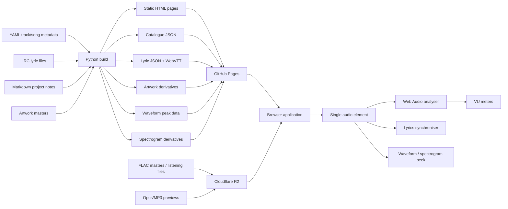
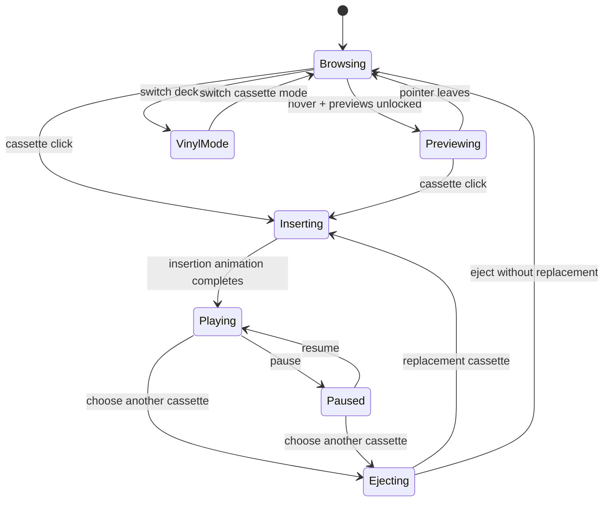

# Deep research report: GitHub Pages music showcase with cassette-first UX

## Executive summary

The cassette concept is technically practical and, after inspecting the supplied Claude build, I would **restore it as the primary interaction rather than accept the move to records**.

The change to vinyl in the supplied build was not caused by a browser, GitHub Pages, audio-format or animation constraint. Its README explicitly says that the original report specified cassettes, but Claude changed the interface because the four supplied pieces of artwork were square record sleeves. That is a design choice made from the current assets, not an architectural necessity.

My recommendation is therefore:

**Cassette mode is the canonical experience. Vinyl mode becomes an optional alternate skin.**

The primary aesthetic should be a late-night listening room crossed with laboratory/studio hardware: near-black surroundings, restrained neon accents, isolated spotlights over the cassette catalogue, warm Numitron-style typography for numbers and status displays, and a **golden-yellow incandescent hardware glow** when a cassette is selected and inserted. The cassette should behave like an object rather than simply being a differently shaped album card.

The existing Claude build has several architectural decisions worth keeping: static generation, YAML as catalogue source, LRC as lyric source, one shared audio element, permanent track URLs, generated JSON/VTT, build-time validation, and Playwright tests. There is no strong technical reason to replace this with React or a backend.

The biggest architectural change I recommend concerns **FLAC**. A GitHub Pages site may be no larger than 1 GB and has a soft bandwidth limit of 100 GB/month. Ordinary GitHub repositories also reject individual files larger than 100 MiB, and Git LFS explicitly cannot serve GitHub Pages content. A substantial catalogue of full-length FLAC files will therefore outgrow Pages quickly. citeturn13search2turn14search0turn14search13

For example, merely as an illustrative bitrate calculation, a four-minute track averaging 700–1,000 kbit/s would be roughly 21–30 MB. One hundred such tracks would therefore occupy roughly **2.1–3.0 GB before artwork, previews, documentation or site assets**. FLAC is lossless and its actual bitrate varies considerably with the source material, so these figures are planning examples rather than predictions. citeturn14search3

I would consequently use this split:

| Responsibility | Recommended home |
|---|---|
| HTML, CSS, JavaScript | GitHub Pages |
| Project documentation | GitHub Pages |
| YAML/LRC source | Git repository |
| Catalogue JSON | Generated into Pages |
| Artwork thumbnails | GitHub Pages |
| Waveform/spectrogram assets | GitHub Pages where practical |
| Short compressed hover previews | GitHub Pages or media storage |
| Full FLAC catalogue | Cloudflare R2 |
| Optional Opus/MP3 derivatives | R2 or Pages |
| FLAC downloads | R2 |

Cloudflare R2 is particularly suitable for this arrangement because its current Standard pricing is $0.015/GB-month, its free tier includes 10 GB-month of storage and 10 million Class B read operations per month, and Cloudflare currently charges no Internet egress fee for R2. citeturn14search2 Backblaze B2 is a reasonable alternative; its current published starting price is $6.95/TB/month with egress up to three times average monthly storage included. citeturn15search0

This does **not** turn the site into a backend application. GitHub Pages remains entirely static. The catalogue simply points its audio URLs at an object-storage domain.

The other major recommendation is to design for a large catalogue from the outset. Do not build a shelf whose DOM contains 200 fully interactive players, spectrograms and lyric documents. Build:

**songs → versions → individual generations/releases**

and make only the currently selected item expensive.

A visitor might therefore see:

```text
GIMMIE GIMMIE BALL
├── ACE-Step v1
├── ACE-Step reference remix
├── MiniMax v1
├── MiniMax v2 — CFG 1.70 / 26 steps
├── MiniMax v2 — CFG 1.70 / 31 steps   ← showcase pick
└── MiniMax v2 — CFG 1.70 / 36 steps
```

That structure is unusually valuable for your project because the multiplicity of versions is not clutter to conceal: **it is part of the research story**.

The recommended implementation is:

| Layer | Recommendation |
|---|---|
| Build | Keep the existing Python static generator unless the documentation becomes much larger |
| Content | YAML metadata + Markdown documentation + LRC lyrics |
| Runtime | Semantic HTML + CSS + small vanilla JS modules |
| Audio | One native `HTMLAudioElement` |
| VU visualisation | Web Audio API `AnalyserNode` |
| Waveform | wavesurfer.js, loaded only for selected track |
| Spectrogram | Precomputed image/data, click mapped to playback time |
| Major animations | GSAP |
| Small animations | CSS transforms/opacity |
| Hosting | GitHub Pages |
| Full audio | Cloudflare R2 |
| Lyrics | LRC source → generated JSON + WebVTT |
| Search/filter | Static catalogue JSON + client-side indexing |
| Backend | None |

wavesurfer.js supports pre-decoded peaks, interaction and a spectrogram plugin, while its documentation specifically recommends precomputed peaks to avoid having to download and decode large audio files merely to draw the waveform. citeturn15search3turn15search7turn15search18 GSAP is currently free to use and is framework-agnostic, making it a good fit for a vanilla-JavaScript static site with a complex cassette insertion timeline. citeturn15search1turn15search23

The result I would aim for is not "Spotify with cassette-shaped album covers". It should feel more like:

> **You walk into a dark studio after midnight, browse physical tapes under pool-of-light spotlights, pick one up, push it into a glowing machine, and the laboratory around it comes alive.**

The technical documentation sits behind that theatrical front end rather than competing with it.

## Architecture and recommended stack

The best thing about the existing implementation is that it has already avoided several unnecessary complications. GitHub Pages is fundamentally static hosting, so a static content pipeline is a natural fit. citeturn13search2

I would **not rewrite the current Python generator merely to use Astro, React or another fashionable framework**. Astro would be a defensible choice from scratch because it can statically prerender GitHub Pages sites and its content collections can consume structured formats such as YAML and JSON, but that does not make a rewrite inherently useful. The present build already has most of the capabilities you actually need. citeturn7search0turn6search0

The architecture should instead evolve from the current implementation.

| Component | Choice | Reason |
|---|---|---|
| Site generator | Existing Python scripts | Already working; low dependency burden |
| Templates | HTML | Maximum control over unusual interface |
| Styling | CSS custom properties + modern layout | Ideal for skins/themes |
| Client behaviour | ES modules / vanilla JS | Interaction is substantial but application state is still modest |
| Animation | CSS + GSAP | CSS for continuous/repeated motion; GSAP for sequenced mechanical motion |
| Audio playback | Native `<audio>` | Browser handles streaming, buffering, seeking and media lifecycle |
| Audio analysis | Web Audio API | VU meters/spectrum from actual playing track |
| Waveform | wavesurfer.js | Mature interaction layer; supports precomputed peaks |
| Lyrics | LRC → JSON/VTT at build | Human-friendly source, browser-friendly output |
| Catalogue | YAML → JSON at build | Maintainable source + efficient runtime index |
| Docs | Markdown → HTML | Appropriate for technical narrative |
| Search | Browser-side catalogue filtering | No server necessary |
| Media | R2 | Removes FLAC from Pages storage/bandwidth constraints |

GSAP is particularly useful for the "physical action" animations because these are sequences rather than simple effects: lift cassette, translate, rotate, reveal deck slot, insert, compress spring, flash indicator, activate light, begin reel rotation. GSAP is currently available free of charge and works with vanilla JavaScript. citeturn15search1turn15search23 Motion is another credible option and is MIT-licensed, but for this project GSAP's timeline model is the more natural fit. citeturn15search2

**The global player should remain a singleton.** One `<audio>` element should survive track changes. That is already something the supplied implementation tests for, and it becomes increasingly important as the catalogue grows.

A useful conceptual architecture is:



The catalogue should explicitly distinguish **composition**, **version** and **release/generation** rather than treating each audio file as an unrelated track.

For example:

```yaml
song:
  id: gimmie-gimmie-ball
  title: Gimmie Gimmie Ball

release:
  id: gimmie-gimmie-ball-minimax-v2-s31
  version_label: MiniMax v2 · 31 steps
  featured: true

generation:
  model: minimax-music-3
  cfg: 1.70
  steps: 31
  seed: 7

media:
  lossless:
    src: https://media.example.com/gimmie-gimmie-ball/v2/s31.flac
    type: audio/flac
  web:
    src: https://media.example.com/gimmie-gimmie-ball/v2/s31.opus
    type: audio/ogg
  preview:
    src: https://media.example.com/gimmie-gimmie-ball/v2/s31-preview.opus

lyrics:
  source: gimmie-gimmie-ball-v2.lrc

display:
  cassette_art: gimmie-gimmie-ball-v2.webp
  cassette_label: GBR-014-B
```

That immediately enables views such as:

```text
Showcase
All songs
ACE-Step
MiniMax
Reference remix
Experiments
Featured versions
All versions
```

and allows one composition to own ten or twenty versions without polluting the top-level library.

Each release should also have a permanent URL. This is already a good decision in the supplied build because the interactive gallery should never be the only way to reach a track. A permanent page can expose the audio, complete lyrics, provenance, experiment notes and accessible controls even when JavaScript or animation is unavailable.

For very large catalogues, I would generate pages at two levels:

```text
/music/gimmie-gimmie-ball/
/music/gimmie-gimmie-ball/minimax-v2-s31/
```

The first is the song's history and version selector; the second is a reproducible generation/release record.

## Audio hosting, formats and catalogue scale

This is the area where the initial Claude implementation needs its biggest architectural revision.

GitHub currently documents three constraints that directly matter:

GitHub Pages sites may be no larger than **1 GB**, Pages has a soft **100 GB/month bandwidth limit**, and normal GitHub repositories block individual files greater than **100 MiB**. Git LFS cannot be used to supply assets to GitHub Pages. citeturn13search2turn14search0turn14search13

Therefore, a large FLAC catalogue should not live inside the Pages deployment.

FLAC itself is completely reasonable for what you want. It is lossless rather than perceptually compressed, and the codec was designed for streamable lossless audio. citeturn10search0turn10search1 The issue is simply its size relative to the hosting platform.

A useful comparison for a four-minute song is:

| Delivery format | Example bitrate | Approx. four-minute size | Role I recommend |
|---|---:|---:|---|
| Opus | 160 kbit/s | 4.8 MB | Hover/mobile preview or optional efficient playback |
| MP3 | 256 kbit/s | 7.68 MB | Maximum-convenience fallback |
| MP3 | 320 kbit/s | 9.6 MB | High-quality lossy fallback |
| FLAC | 700 kbit/s example | 21 MB | Lossless playback/download |
| FLAC | 1,000 kbit/s example | 30 MB | Lossless playback/download |

The compressed sizes above follow directly from bitrate × duration; the two FLAC rows are **illustrative planning assumptions only**, because actual FLAC bitrate varies with source audio. MDN recommends Opus as a strong general-purpose web audio codec and describes FLAC as appropriate where lossless quality is required. citeturn14search3

At an illustrative 30 MB average:

| Catalogue size | Audio alone |
|---:|---:|
| 20 FLAC tracks | ~600 MB |
| 30 | ~900 MB |
| 50 | ~1.5 GB |
| 100 | ~3 GB |
| 250 | ~7.5 GB |
| 500 | ~15 GB |

This means even **30-ish ordinary-length lossless tracks could bring the Pages deployment close to its 1 GB maximum before the rest of the website is counted**. citeturn13search2

Bandwidth is an even better reason to separate the media. At an illustrative 30 MB transfer, 100 GB corresponds to only about 3,333 complete track transfers in the theoretical case where every play transfers the full file. Actual browser traffic will differ because players use buffering and ranged requests, users may stop early, and caches can intervene, but the calculation shows the order of magnitude. citeturn13search2

**Recommended hosting topology**

```text
good-boy-records.github.io
    HTML
    CSS
    JS
    docs
    catalogue JSON
    small artwork
    lightweight metadata

media.good-boy-records.example
    FLAC
    Opus/MP3
    previews
    optional large spectrograms
```

Cloudflare R2 is currently attractive because Standard storage is $0.015/GB-month, the Standard free tier includes 10 GB-month of storage, one million Class A operations and ten million Class B operations each month, and Internet egress is currently free. citeturn14search2 A 3 GB collection would therefore fit comfortably inside the present storage component of that free tier, although requests, account policies and future pricing still need to be monitored. citeturn14search2

R2 supports ranged object access, which matters for browser seeking, and its custom-domain configuration can return the appropriate CORS headers when the bucket CORS policy is configured. citeturn14search1turn14search14turn13search0

That CORS configuration becomes essential if the player uses the Web Audio API for VU meters. MDN specifically notes that media loaded from another domain needs the `crossorigin` attribute when it is passed into Web Audio. citeturn13search1

The player should therefore resemble:

```html
<audio
    id="main-player"
    preload="metadata"
    crossorigin="anonymous">
</audio>
```

and R2 should permit the GitHub Pages/custom site origin.

I would **not preload FLAC files for the catalogue**. The cards contain metadata and artwork only. Full audio is assigned to the shared player only after selection.

For hover behaviour, create a separate lightweight preview path:

```text
full FLAC:
gimmie-gimmie-ball-v2.flac       ~ potentially tens of MB

hover preview:
gimmie-gimmie-ball-v2-preview.opus
                                       ~ a few hundred KB
```

That means someone can sweep across twenty cassettes without accidentally requesting hundreds of megabytes.

There are three sensible quality strategies:

| Strategy | Behaviour | Assessment |
|---|---|---|
| FLAC only | Everything plays losslessly | Pure, but bandwidth-heavy |
| FLAC full + Opus previews | Full songs lossless; hovers lightweight | **Recommended** |
| User-selectable FLAC/efficient | Listener chooses Lossless or Data Saver | Best long-term UX |

I favour the third eventually. A tiny switch in the deck could literally read:

```text
SOURCE
[ LOSSLESS ] [ ECONOMY ]
```

which fits the physical hardware aesthetic rather nicely.

Do not create multiple audio elements merely to support formats. The player can resolve the appropriate URL when the cassette is inserted.

## Interaction, visual design and responsive UX

The design should be returned to the original concept and made more committed, not less.

**Primary visual world**

The base background should be extremely dark, but not flat #000. Use several near-black surfaces so that the hardware can disappear into darkness at the edges.

The key light should be a **warm gold/amber source**, not generic cyan cyberpunk neon. Neon can exist in secondary details, but the emotional centre should resemble old audio equipment warming up.

A useful visual hierarchy would be:

```text
BACKGROUND
near-black / midnight blue-black

AMBIENT LIGHT
muted violet / dirty cyan / deep red accents

PRIMARY ACTIVE LIGHT
golden yellow / tungsten / amber

NUMITRON DISPLAY
warm orange-amber digits

TEXT
warm off-white

INACTIVE HARDWARE
charcoal / gunmetal / smoked glass
```

This is an important distinction. "Neon" should describe the atmosphere around the machine. **The machine itself should glow like real electrical hardware.**

Numitron-style displays can be reproduced with a suitable licensed typeface or, better still for the principal counters, SVG/HTML segment shapes. That lets individual segments bloom subtly and gives the digits more physical presence than ordinary orange text.

The core interaction is best modelled as an explicit state machine:



That is preferable to a pile of independent click handlers because animation bugs usually occur when the user acts halfway through a previous animation.

**Cassette browsing**

A cassette should not merely be a 3:2 image with a hover transform.

I would give each card several layers:

```text
┌─────────────────────────────────────────┐
│       transparent plastic shell         │
│                                         │
│         ○                    ○          │
│          tape / reel window             │
│                                         │
│      ┌───────────────────────────┐      │
│      │       custom artwork      │      │
│      │  title / catalogue code   │      │
│      └───────────────────────────┘      │
│            ▽ tape opening               │
└─────────────────────────────────────────┘
```

The artwork is therefore placed **on the cassette label**, rather than forcing all existing album art to become cassette-shaped. Square art can be cropped or inset inside the rectangular physical shell.

That directly solves the reason Claude changed the concept to records.

A hovered cassette can:

- lift 4–8 px;
- rotate by perhaps one or two degrees according to pointer position;
- gain edge/specular highlights;
- illuminate its label;
- reveal a compact metadata strip;
- begin preview after an intent delay.

The supplied build's existing choice to delay hover preview by roughly 220 ms is sensible. Browser autoplay policy means unprompted audio cannot be treated as guaranteed: `HTMLMediaElement.play()` returns a Promise and can reject when browser autoplay policy prevents playback. citeturn13search3turn13search6

The robust approach is:

```js
let previewsUnlocked = false;

async function playTrackFromClick(track) {
    setMainSource(track);
    try {
        await player.play();
        previewsUnlocked = true;
    } catch {
        showManualPlayState();
    }
}

const preciseHover = matchMedia(
    "(hover: hover) and (pointer: fine)"
).matches;

async function tryPreview(track) {
    if (!previewsUnlocked || !preciseHover || playerIsPlaying()) return;

    preview.src = track.media.preview;

    try {
        await preview.play();
    } catch {
        // Autoplay policy won. Do not treat this as an application failure.
    }
}
```

CSS can distinguish a primary pointer that genuinely supports hover from a coarse/touch input using the `hover` and `pointer` media features. citeturn9search4turn9search0

On mobile, **there should be no fake hover interaction**.

I recommend:

```text
Desktop:
hover cassette → preview
click cassette → insert/play

Touch:
tap cassette → select/reveal details
tap large PLAY/INSERT control → insert/play
```

Alternatively, one tap can insert immediately if you prefer speed over inspection. That is one of the design questions at the end.

**Cassette insertion**

This is where GSAP earns its place.

A good sequence could be:

```text
0 ms      cassette rises off shelf
100 ms    shadow separates
180 ms    gallery environment dims slightly
250 ms    cassette begins moving towards deck
450 ms    cassette scales/rotates to deck perspective
650 ms    slot light wakes
760 ms    cassette enters slot
900 ms    slight mechanical overshoot
980 ms    cassette locks home
1040 ms   golden lamp clicks on
1120 ms   Numitron display changes from ---- to 00:00
1180 ms   reel motion begins
1200 ms   audio begins / fades in
1250 ms   lyrics panel wakes
```

Those timings are artistic values, not technical requirements. The important principle is **mechanical causality**: the deck should appear to react to the cassette rather than displaying unrelated animations.

The sound itself could begin slightly before the animation finishes if that feels better, but visually the transport must make sense.

Use CSS `transform` and `opacity` for the main motion rather than animating layout properties. Reels can use simple CSS rotation while playback is active:

```css
.cassette[data-state="playing"] .reel {
    animation: reel-spin 1.4s linear infinite;
}

@keyframes reel-spin {
    to { transform: rotate(1turn); }
}

@media (prefers-reduced-motion: reduce) {
    .cassette .reel {
        animation: none !important;
    }
}
```

Browsers expose `prefers-reduced-motion` specifically so sites can adapt non-essential animation for users who request reduced motion. citeturn9search36

**VU meters**

Use the actual audio signal rather than a canned animation.

The Web Audio API provides an `AnalyserNode` for extracting time/frequency data from an audio graph, and visual updates can be driven with `requestAnimationFrame()`. citeturn0search3turn0search20

Architecturally:

```js
const context = new AudioContext();
const source = context.createMediaElementSource(player);
const analyser = context.createAnalyser();

source.connect(analyser);
analyser.connect(context.destination);
```

Then calculate a level from the analyser and move two needles or illuminated bars.

Crucially, create this graph **once**, not once per cassette.

For genuine retro equipment, analogue needles may look better than modern LED bars. A little inertia can be added to the visual value:

```js
needleValue += (targetValue - needleValue) * 0.12;
```

The two channels can be treated separately if the audio analysis implementation exposes them in the desired way, or the first iteration can present a combined programme level.

**Alternate vinyl UX**

This should be a **mode**, not a second website.

The underlying player, catalogue, lyrics, search, URLs and track state stay identical. Only the physical metaphor changes.

```text
CASSETTE MODE
cassette shelf
cassette transport
reels
tape window
Numitron counter

VINYL MODE
record sleeves
turntable
platter
tonearm
groove/progress visual
different physical animations
```

A physical selector could work beautifully:

```text
FORMAT
 TAPE  ◉────○  VINYL
```

Persist the preference in `localStorage`.

Do not load two separate giant DOMs. Both modes should render from the same track records.

I would make cassette the default because it is the project's intended visual identity, and treat vinyl as a "listening-room" alternative.

**Large catalogue UX**

For dozens or hundreds of releases, an endless homogeneous shelf will become tiring.

Use three levels:

```text
DISCOVER / FEATURED
curated showcase cassettes

LIBRARY
all songs grouped by composition

EXPERIMENTS
all versions and generations
```

The first visit should still feel curated.

A good catalogue toolbar could expose:

```text
Search…

Model:     All | ACE-Step | MiniMax
Type:      Showcase | All | Experiment
Song:      Any
Era/style: Any
Version:   Best | All
Sort:      Featured | Newest | Song | Model
```

I would avoid conventional numbered pagination until there are enough items to make it useful. For perhaps tens to low hundreds of small metadata cards, client-side filtering is simple. If the catalogue becomes extremely large, render results in batches rather than constructing every card on initial load.

Playlists can remain entirely browser-side:

```text
Featured
ACE-Step survivors
MiniMax favourites
Same song, different models
Reference remix tests
CFG sweep
Western swing
Dog-related crimes against music
```

They are really filtered views over the same catalogue.

## Lyrics, visualisation, performance and accessibility

The existing LRC decision is sound.

LRC is pleasant for authoring because it stays readable:

```text
[00:12.40]Give me the ball
[00:16.70]I require the ball
[00:20.90]This situation is unacceptable
```

At build time I would produce:

```text
source:
lyrics/gimmie.lrc

generated:
data/lyrics/gimmie.json
data/lyrics/gimmie.vtt
```

WebVTT is a W3C timed-text format intended for time-aligned text associated with media, including timed metadata, so generating it gives the catalogue a standardised derivative even if the custom player primarily uses JSON. citeturn16search3turn16search23

Do not embed lyrics for hundreds of versions into the homepage.

The current implementation already recognises this eventual issue. For the larger catalogue you describe, I would move now to:

```text
catalogue page loads:
metadata only

cassette selected:
fetch lyric JSON
fetch waveform peaks
fetch relevant provenance summary

track begins:
fetch/stream audio

experiment details expanded:
load deeper notes if necessary
```

**Lyric behaviour**

The panel should display perhaps:

```text
            previous line

     CURRENT LINE OF THE SONG

               next line
```

but retain the complete transcript in the document so that it remains useful without animation.

Do not announce every changing lyric through `aria-live`; that would bombard assistive technology. Instead, the player can announce a simple state change such as:

```text
Now playing: Gimmie Gimmie Ball, MiniMax version 2.
```

and the lyric region remains ordinary readable text.

Clicking a lyric line can optionally seek to it.

Manual lyric scrolling should suspend automatic centring temporarily, which the supplied build already tests. That is good UX because otherwise the interface fights someone trying to read ahead.

**Waveforms and spectrograms**

For the finished site I would distinguish three different visuals:

| Visual | Purpose | Implementation |
|---|---|---|
| VU meter | Immediate live level | Web Audio |
| Waveform | Track navigation | Precomputed peaks + wavesurfer |
| Spectrogram | Technical/experimental inspection | Precomputed static image/data |

wavesurfer.js can render from pre-decoded peaks without first fetching and decoding the complete audio, and its documentation specifically discusses this route for performance and memory. citeturn15search7turn15search18 BBC's Peaks.js documentation similarly warns that client-side waveform generation requires the complete file and significant processing, strengthening the case for build-time waveform generation for long audio. citeturn5search2

For FLAC, that recommendation is especially strong.

Do not make the browser download a 30 MB song just to draw 700 pixels of waveform.

Produce something such as:

```text
gimmie-v2-s31.peaks.json       20–100 KB
gimmie-v2-s31-spectrum.webp    100–300 KB
```

The precise output sizes will depend on chosen dimensions and compression.

The spectrogram does not need a complex plugin merely to be seekable. A pre-rendered image can map its x-coordinate directly to playback time:

```js
spectrogram.addEventListener("pointerdown", (event) => {
    const rect = spectrogram.getBoundingClientRect();
    const fraction = Math.max(
        0,
        Math.min(1, (event.clientX - rect.left) / rect.width)
    );

    if (Number.isFinite(player.duration)) {
        player.currentTime = fraction * player.duration;
    }
});
```

This gives you **click-to-seek on a real spectrogram with almost no runtime computational cost**.

wavesurfer.js remains useful for the waveform because it already provides interaction and can consume precomputed peaks. citeturn15search3turn15search7

**Progressive loading**

The landing page should initially download only:

- document HTML;
- core CSS;
- core JavaScript;
- catalogue index;
- currently visible artwork thumbnails;
- fonts needed above the fold.

It should **not initially download**:

- FLAC files;
- hover previews for every track;
- full-resolution artwork for every track;
- lyrics for every version;
- waveforms for every version;
- spectrograms for every version;
- experiment-page data.

Artwork below the visible area should use native lazy loading where appropriate.

Hover previews should be fetched only once hover intent is established. Full FLAC gets assigned only at actual selection/play.

A selected track can prefetch the likely next useful assets, for example its lyrics and waveform, while the insertion animation runs.

**Animation performance**

The largest animation risks are not the cassette reels; they are effects such as:

- enormous blurred neon layers;
- animated full-screen filters;
- several simultaneous `box-shadow` blooms;
- large moving masks;
- constantly repainting spectrograms;
- dozens of live audio analysers.

The visual rule should therefore be:

> animate objects, not the whole page.

A fake spotlight can be a fixed radial gradient whose opacity changes. It does not need to track the mouse at 120 updates per second.

A glow can often be split into a modest CSS shadow plus a pseudo-element with a blurred radial gradient.

Only the selected cassette needs active reel animation.

Only the selected track needs a VU analyser.

Only the selected track needs its waveform instantiated.

Only visible cards need high-resolution art.

**Accessibility**

This design can remain theatrical without sacrificing keyboard or reduced-motion use.

WCAG 2.2 specifies a 24×24 CSS-pixel minimum pointer target at AA subject to its defined exceptions, and keyboard focus must remain visible rather than being obscured by authored interface elements. citeturn16search0turn16search18

In practice I would make primary transport controls nearer 44×44 CSS pixels or larger; WCAG identifies 44×44 as the enhanced target-size level. citeturn16search30

Each cassette should ultimately be a semantic button or contain one:

```html
<button
    class="cassette"
    aria-label="Play Gimmie Gimmie Ball, MiniMax version 2">
    ...
</button>
```

Keyboard behaviour:

```text
Tab             move between interactive cassettes/controls
Enter / Space   insert/select cassette
Space           play/pause when player control focused
Left/Right      seek only when seek control is focused
Escape          close expanded metadata/filter overlays
```

Do not make general arrow keys globally hijack page navigation.

Respect `prefers-reduced-motion`, and also consider an explicit site setting:

```text
MOTION
FULL / REDUCED / OFF
```

W3C guidance also requires control over audio that starts automatically and persists beyond a few seconds; more fundamentally, browser autoplay itself cannot be relied on. citeturn13search3turn1search15 The proposed explicit-play-before-hover-preview approach avoids both UX and technical problems.

Neon and Numitron effects should not flash rapidly. Keep illumination transitions as slow fades or steady glows rather than strobing.

The dark design needs deliberate contrast testing: an object looking wonderfully "dim and authentic" on your monitor can become invisible on a lower-quality panel.

## Documentation, provenance, legal considerations and repository assets

The music is the entrance, but the site becomes genuinely distinctive when each selected cassette has a path into the experiment that created it.

I would make the lower portion of the deck something like:

```text
NOW PLAYING
GIMMIE GIMMIE BALL
MiniMax Music 3 · V2 · Track 031

━━━━━━━━━━━━━━━━━━━━━━━━━━━━━━━━━━━━━━

GENERATION
CFG       1.70
Steps     31
Seed      7
Date      2026-xx-xx
Workflow  minimax-v2

SOURCE
Song definition    v2
Lyrics             v3
Experiment         Step sweep A

[ VIEW FULL EXPERIMENT ]
[ COMPARE OTHER VERSIONS ]
```

That provenance should be rendered from catalogue data rather than manually copied into track pages.

A useful metadata schema would include:

```yaml
identity:
  song_id:
  release_id:
  title:
  version:
  track_number:

generation:
  model:
  model_version:
  interface:
  mode:
  seed:
  cfg:
  steps:
  reference_strength:
  reference_source:
  created:

provenance:
  song_definition:
  prompt_version:
  lyric_version:
  workflow_version:
  parent_generation:
  experiment_id:

review:
  human_rating:
  ai_rating:
  promoted:
  notes:

rights:
  audio_owner:
  lyrics_owner:
  artwork_owner:
  reference_audio_public: false
  ai_disclosure: true
```

Not every field applies to both ACE-Step and MiniMax; nullable model-specific fields are preferable to pretending the systems expose identical parameters.

The technical side of the site should have two different editorial modes:

**The Working Solution** is prescriptive:

```text
Here is what I use now.
Here is how to install it.
Here are the starting settings.
Here are the files.
Here are the traps.
```

**The Journey / Experiments** is evidential:

```text
Here was the hypothesis.
Here is what I changed.
Here are the candidates.
Here is what happened.
Here is what I concluded.
```

Experiment pages should therefore contain comparisons directly. A CFG or step sweep should be capable of presenting several small cassette versions of the *same song*, which is where your multiple-version requirement becomes an advantage rather than a burden.

For example:

```text
SAMPLING STEPS — GIMMIE GIMMIE BALL V2

[ 16 ]   [ 21 ]   [ 26 ]   [ 31 ]   [ 36 ]
   │        │        │        │        │
  play     play     play     BEST     play
```

Clicking between them should preserve the same playback time where possible. That would allow a listener to compare, say, 01:14 in version A with 01:14 in version B. Technically that is simple with a singleton player:

```js
const oldTime = player.currentTime;

loadRelease(nextRelease);

player.addEventListener("loadedmetadata", () => {
    player.currentTime = Math.min(oldTime, player.duration);
}, { once: true });
```

That may become one of the most useful research interfaces on the entire site.

**Repository layout**

I would evolve the current layout towards:

```text
/
├── README.md
├── index.html                       # generated
│
├── content-source/
│   ├── songs/
│   │   ├── gimmie-gimmie-ball.yaml
│   │   └── ...
│   ├── releases/
│   │   ├── gimmie-minimax-v2-s31.yaml
│   │   └── ...
│   ├── lyrics/
│   │   └── *.lrc
│   └── docs/
│       ├── working-solution/
│       ├── journey/
│       ├── acestep/
│       ├── minimax/
│       ├── experiments/
│       ├── tools/
│       └── failures/
│
├── templates/
│   ├── home.html
│   ├── music.html
│   ├── song.html
│   ├── release.html
│   ├── experiment.html
│   └── doc.html
│
├── assets/
│   ├── css/
│   │   ├── base.css
│   │   ├── night-lab.css
│   │   ├── cassette.css
│   │   ├── vinyl.css
│   │   └── docs.css
│   ├── js/
│   │   ├── app.js
│   │   ├── catalogue.js
│   │   ├── transport.js
│   │   ├── cassette.js
│   │   ├── vinyl.js
│   │   ├── lyrics.js
│   │   ├── analyser.js
│   │   ├── waveform.js
│   │   └── preferences.js
│   ├── img/
│   │   ├── cassette/
│   │   ├── covers/
│   │   ├── spectrograms/
│   │   └── docs/
│   └── fonts/
│
├── data/
│   ├── catalogue.json               # generated
│   ├── lyrics/                      # generated
│   └── peaks/                       # generated
│
├── masters/                         # ignored/local as appropriate
│   ├── artwork/
│   └── audio/
│
├── tools/
│   ├── build.py
│   ├── validate_catalogue.py
│   ├── build_lyrics.py
│   ├── build_audio_derivatives.py
│   ├── build_waveforms.py
│   ├── build_spectrograms.py
│   ├── check_links.py
│   └── test_player.py
│
└── .github/
    └── workflows/
        └── pages.yml
```

The actual FLAC files need not exist in the repository at all; their public media URLs can be generated from their release IDs.

**Legal and DMCA**

The safest publication rule is simple:

**Only place audio, lyrics, artwork and reference-derived material online where you own the necessary rights or have permission to distribute it.**

UK copyright protection can separately apply to musical works, lyrics and sound recordings. Copyright protection arises automatically rather than requiring registration. citeturn16search9turn16search1

This is particularly relevant to reference-remix experiments. Even where your generated output is your own project artefact, publishing a third-party source track, substantial copied lyrics or third-party artwork raises separate rights questions.

UK law includes a fair-dealing exception for caricature, parody and pastiche, but it is a **limited fair-dealing exception**, not blanket permission to republish source works. citeturn16search1turn16search9

GitHub operates a DMCA takedown process for content alleged to infringe copyright. citeturn16search2

For that reason I would attach explicit rights provenance to every public release:

```text
Audio: original AI-assisted generation — cleared for publication
Lyrics: original
Artwork: original/commissioned/AI-assisted
Reference audio: not distributed
AI-generated content disclosure: yes
```

Where an experiment involves a recognisable copyrighted reference, the documentation can describe the test without necessarily serving the source recording.

This is practical risk management rather than legal advice.

## Delivery sequence and testing plan

Because the supplied build already contains a functioning static pipeline, I would **iterate rather than restart**.

The implementation sequence should be:

| Phase | Deliverable | Purpose |
|---|---|---|
| Foundation | Revised catalogue schema for songs/releases/versions | Prevent later catalogue migration |
| Media architecture | External FLAC base URL, preview derivatives, CORS | Make large catalogue viable |
| Cassette UI | Shelf + cassette component + deck | Restore intended identity |
| Transport | Insert/eject/play/pause/reels/Numitron/VU | Complete primary experience |
| Lyrics | Lazy-loaded JSON/VTT synchronisation | Add performance-safe lyric display |
| Discovery | Search/filter/version grouping/playlists | Support large catalogue |
| Research UI | Provenance + experiment comparisons | Connect music to project history |
| Vinyl skin | Alternate record/turntable mode | Add optional second physical metaphor |
| Optimisation | Peaks, spectrograms, lazy loading | Keep large catalogue fast |
| Hardening | Accessibility, browser tests, build validation | Prepare public deployment |

This is deliberately a **dependency sequence rather than a time estimate**. In particular, the data model and media-storage decision should happen before polishing animations, because those two choices affect almost everything that follows.

A particularly important boundary is:

```text
PHASE ONE
make one cassette perfect

THEN

PHASE TWO
make 100 cassettes cheap
```

Do not initially animate fifty cassettes. Build the player around one representative track until insertion, playback, lyrics, seeking, VU and responsive behaviour are correct; then optimise catalogue rendering.

**Cross-browser tests**

At minimum, test current stable versions of:

- Chrome/Chromium desktop;
- Firefox desktop;
- Safari macOS;
- Edge;
- Safari iPhone/iPad;
- Chrome Android.

Autoplay is specifically an area where browser policy differs and `play()` rejection must be handled rather than assumed away. citeturn13search3turn13search6

Test:

```text
fresh visit with no previous interaction
click-to-play
hover before first play
hover after first successful play
switch track while playing
switch track while paused
rapidly click several different cassettes
seek before enough media has buffered
network disconnect during playback
audio URL 404
lyric JSON 404
spectrogram missing
return from background tab
screen lock/mobile media controls
```

The Media Session API can provide track metadata to operating-system/browser media controls as progressive enhancement, although its capabilities should not be assumed universally. citeturn9search3turn9search7

**Memory/performance tests**

Test deliberately with a synthetic catalogue much larger than the launch set:

```text
50 releases
100 releases
250 releases
500 releases
```

The test should verify that selecting many different songs does not cause:

- old audio elements to accumulate;
- old AudioContexts to accumulate;
- wavesurfer instances to remain alive;
- object URLs to leak;
- event listeners to multiply;
- all lyric files to remain unnecessarily retained;
- all preview audio to preload.

wavesurfer instances and their listeners should be destroyed/reused when a track changes rather than stacked. wavesurfer documents lifecycle/event handling and pre-decoded peak support specifically for these types of scenarios. citeturn15search27turn15search7

**Responsive tests**

Test at least:

```text
320px narrow phone
375–430px normal phones
tablet portrait
tablet landscape
small laptop
1440p desktop
ultrawide
200% browser zoom
400% browser zoom for critical reading paths
```

The desktop player can place the deck and lyrics side by side:

```text
┌──────────────────────────────────────────────┐
│                   library                    │
├─────────────────────┬────────────────────────┤
│                     │                        │
│    cassette deck    │      live lyrics       │
│                     │                        │
├─────────────────────┴────────────────────────┤
│ provenance / waveform / experiment           │
└──────────────────────────────────────────────┘
```

On mobile, do not simply shrink that arrangement:

```text
┌──────────────────────┐
│ catalogue / cassette │
├──────────────────────┤
│ compact deck         │
├──────────────────────┤
│ lyrics               │
├──────────────────────┤
│ waveform             │
├──────────────────────┤
│ provenance           │
└──────────────────────┘
```

A sticky miniature transport at the bottom of the phone is useful once the user scrolls away from the physical deck.

**Accessibility tests**

The complete gallery should be usable:

- with the keyboard only;
- at large zoom;
- with reduced-motion enabled;
- without hover;
- without audio previews;
- without JavaScript for basic track-page access;
- using a screen reader for track names and transport controls.

WCAG's guidance on pointer targets, visible focus and hover-triggered content is directly relevant to this style of highly interactive gallery. citeturn16search0turn16search15turn16search18

The key engineering principle across the whole project is:

> **The theatre should enhance the music, while the underlying player remains boringly reliable.**

That gives you room to make the cassette physically ridiculous without making playback fragile.

## Forty design and engineering questions

1. Should the first view show a **small curated Featured shelf**, or immediately expose the complete music library?

2. Roughly how many releases should the design assume at maturity: **50, 100, 250, 500, or more**?

3. Should one cassette represent a **song**, with its versions inside it, or should every individual generation/version appear as its own cassette?

4. For songs with many versions, should clicking the cassette open a **version selector first**, or automatically play the version you have marked as the preferred/master version?

5. Should alternate versions be described mainly by human names such as **“MiniMax final”**, technical names such as **“CFG 1.70 · S31”**, or both?

6. Do you want experiment sweeps such as 16/21/26/31/36 steps to appear in the normal library, or live only on dedicated experiment/comparison pages?

7. Should the cassette artwork be a **full custom rectangular design**, or should existing square artwork appear as the printed label inside a consistent transparent cassette shell?

8. Do you want several physical cassette types—clear shell, black shell, white shell, chrome/high-bias, different label styles—or one standard Good Boy Records cassette design?

9. Should cassette labels include catalogue numbers such as **GBR-014-A**, and should those numbers have meaningful links to song/version chronology?

10. When a pointer hovers over a cassette, should the preview start from a **manually chosen highlight timestamp**, the beginning of the song, or an automatically generated representative section?

11. How long should a hover preview be: roughly **8, 12, 15, 20 or 30 seconds**?

12. Should hover previews become available automatically after the user's first successful playback, or should there be a visible **“Enable hover previews”** control?

13. When the mouse leaves a previewing cassette, should audio stop instantly or perform a short crossfade?

14. When moving directly from one cassette to another, should previews **crossfade**, or should there be a brief period of silence between them?

15. On a touch device, should the first tap **select/reveal the cassette** and a second action play it, or should a single tap immediately insert and play?

16. How literal should the cassette insertion be: a quick stylised movement, or a full physical sequence with deck door/slot, mechanical travel, locking movement and lights switching on?

17. Should the selected cassette remain visibly **inside the deck for the entire song**, including its real artwork and moving reels?

18. When another song is chosen, should the first cassette visibly **eject before the replacement inserts**, even though this adds a short transition between tracks?

19. Should the deck use **analogue needle VU meters**, LED-bar meters, or both?

20. Should the Numitron aesthetic be limited to elapsed time and hardware labels, or should it also influence headings, filter counters and other site typography?

21. How dark should the site be when idle: almost completely black with isolated spotlights, or should the library and room remain substantially visible?

22. Should the golden-yellow glow be reserved strictly for **active/playing hardware**, so that it becomes the site's universal visual indication of “alive”?

23. What secondary neon family do you prefer around that amber core: cyan/blue, magenta/violet, red, mixed neon, or extremely restrained colour?

24. Should spotlight effects be completely fixed and theatrical, or subtly react to the pointer as the visitor moves over the cassette shelf?

25. Should the vinyl interface be a clearly labelled **Cassette / Vinyl mode switch**, or an easter-egg-like physical format selector built into the deck?

26. When switching to vinyl mode, should only the player metaphor change, or should the **entire room/library presentation** change from cassette shelving to record sleeves?

27. Should the site remember the visitor's cassette/vinyl, motion, volume and audio-quality preferences in `localStorage`?

28. Do you want full-song playback to default to **FLAC whenever supported**, or should the visitor explicitly select a “Lossless” mode before the site uses the larger files?

29. Are you happy for the full FLAC catalogue to live on **external object storage such as Cloudflare R2** while GitHub Pages hosts the actual site and documentation?

30. Should every track also have an Opus or MP3 derivative for slower/mobile connections, or is the compressed format intended only for hover previews?

31. Should visitors be offered a visible **Download FLAC** control, or is FLAC intended only as the playback source?

32. Should the player show a waveform at all times, or should the main deck remain visually authentic and put waveform/spectrogram tools inside a separate **Analysis** panel?

33. Do you want a spectrogram on every public track page, only on technical experiment pages, or only where the spectrogram reveals something worth discussing?

34. When a spectrogram or waveform is clicked, should it simply seek the song, or should experiment pages additionally synchronise **several versions to the same timestamp** for A/B comparison?

35. Should synced lyrics show only three or five nearby lines around the current lyric, or show a full scrollable transcript with the current line illuminated?

36. Should clicking a lyric line seek directly to that lyric, and should the listener be able to temporarily disable auto-scrolling while reading ahead?

37. Which provenance fields should ordinary listeners see by default—model/version only—and which should be hidden behind **Technical details**, such as CFG, steps, seed, reference strength and workflow version?

38. For the main documentation navigation, should the historical story be presented chronologically—**early ACE-Step → tooling → Spotify-style app → reference experiments → MiniMax**—or organised primarily by topic with a separate timeline?

39. Should experiment and failure pages be visually plain technical documentation, as in the current build, or should they retain some subdued Numitron/laboratory styling so the entire project feels like one environment?

40. Of all the first-release features—**cassette shelf, insertion animation, Numitron deck, VU meters, synced lyrics, large-library filtering, FLAC/R2 support, waveform, spectrogram, comparison mode and vinyl skin**—which are absolutely required for the first finished public version, and which are explicitly allowed to arrive later?